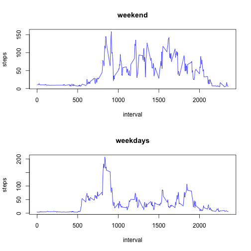

# Reproducible Research: Peer Assessment 1

## Loading and preprocessing the data

```r
unzip("activity.zip")

dat = read.csv("activity.csv")
dat$date <- as.Date(dat$date)

stepsByDay = aggregate(steps ~ date, data = dat, sum)
stepsByInt = aggregate(steps ~ interval, data = dat, mean)
```


## What is mean total number of steps taken per day?

```r
hist(stepsByDay$steps, main = "Mean number of steps per day")
```

 


```r
mns = mean(stepsByDay$steps)
mds = median(stepsByDay$steps)
```

The mean total number of steps per day is 1.0766 &times; 10<sup>4</sup>; the median number of steps is 10765.

## What is the average daily activity pattern?

1. Time series plot

```r
maxInt = stepsByInt[which(max(stepsByInt[, 2]) == stepsByInt[, 2]), ]
plot(steps ~ interval, dat = stepsByInt, type = "l")
abline(v = maxInt[1], col = "red")
```

 


2. Which 5-min interval contains the maximum number of steps?


The maximum number of steps is taken during the interval # 835.

## Imputing missing values
1. Calculate and report the total number of missing values in the dataset (i.e. the total number of rows with NAs)

```r
nas = table(is.na(dat$steps))[["TRUE"]]
```

The number of rows with missing data is 2304.

2. Devise a strategy
Use mean interval value for missing data.

3. Create a new dataset with missing data filled in.

```r
naInt = dat[which(is.na(dat$steps)), ]

# Get corresponding interval values for
xx = merge(naInt, stepsByInt, by = "interval")
# naInt$steps = xx$steps.y
rn = as.integer(row.names(naInt))
dat[rn, "steps"] = xx$steps.y
```

4. Make a histogram of the total number of steps taken each day and Calculate and report the mean and median total number of steps taken per day. 


```r
stepsByDay = aggregate(steps ~ date, data = dat, sum)
mns2 = mean(stepsByDay$steps)
mds2 = median(stepsByDay$steps)
```


```r
hist(stepsByDay$steps, main = "Mean number of steps per day")
```

 


The mean of steps after filling in missing data is 1.0766 &times; 10<sup>4</sup>; the median is 1.1015 &times; 10<sup>4</sup>. The mean remains the same, the median is a bit higher.

## Are there differences in activity patterns between weekdays and weekends?


```r
wd = weekdays(dat$date)
typeOfDay = wd == "Sunday" | wd == "Saturday"
typeOfDay[typeOfDay == TRUE] <- "weekend"
typeOfDay[typeOfDay == FALSE] <- "weekday"
typeOfDay <- as.factor(typeOfDay)
dat = cbind(dat, typeOfDay)
```


```r
stepsByIntWE = aggregate(steps ~ interval, data = dat[dat$typeOfDay == "weekend", 
    ], mean)

stepsByIntWD = aggregate(steps ~ interval, data = dat[dat$typeOfDay == "weekday", 
    ], mean)

par(mfrow = c(2, 1))
plot(steps ~ interval, dat = stepsByIntWE, type = "l", main = "weekend", col = "blue")
plot(steps ~ interval, dat = stepsByIntWD, type = "l", main = "weekdays", col = "blue")
```

 


